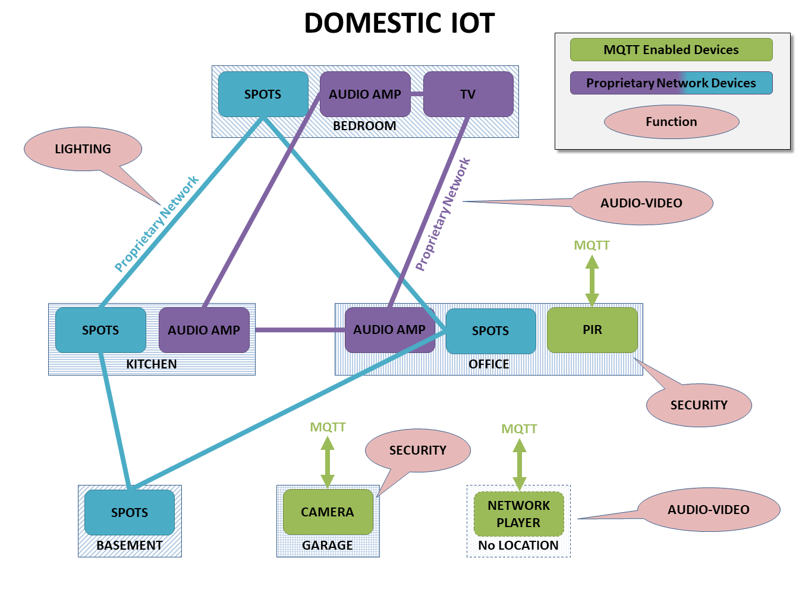
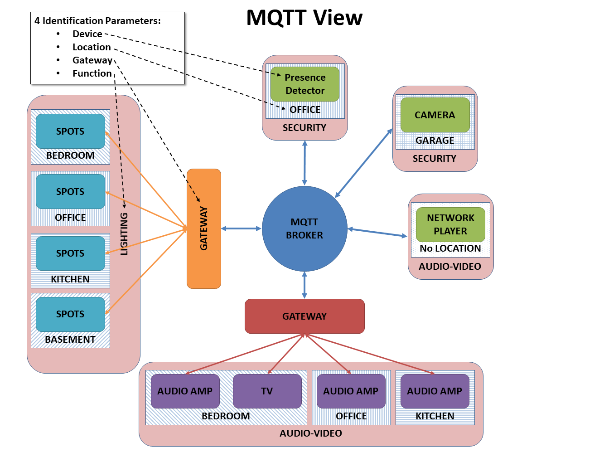

Concepts
========

The model
*********

The primary use case for this project is a domestic environment
with multiple devices of any type: lights, audio video components,
security devices, heating, air conditioning, controllers, keypads, etc...
For many (good) reasons, MQTT has been selected as the communication
protocol. But only a few, if any, devices are MQTT enabled.  Even for
those devices that communicate natively through MQTT, agreeing on a
syntax that make them exchange messages coherently is not easy.

Example
-------

In the example below, our smart home has some lighting connected
in four different rooms through a proprietary network, four audio-video
devices connected through another proprietary network, and some
other devices that are already MQTT-enabled, but which still need
to speak a common language. 

One of the objectives of this project is not only to define a common
MQTT syntax, but also to make it as *intuitive* as possible.  Ideally,
a human should be able to write a MQTT message off-hand and operate
successfully any device in the network.

Message Addressing
------------------

The first step of any message is to define its destination.  A flexible
adressing model should allow for a heuristic approach based on a
combination of characteristics of the recipient, on top of the
standard deterministic approach (e.g. a unique device id).
Four characteristics are usually considered:

- the **function** of the device: lighting, security, audiovideo, etc;
- its **location**;
- its **gateway**: which application is managing that device, if any;
- the name of the **device**

In our example, a MQTT centric view shows how those four characteristics
define all the devices in the network. The 2 gateways are also added.

Some considerations about those four characteristics:

- not all four characteristics need to be provided to address succesfully
  a device, that is the whole point of being flexible;
- any device can have more than one value for each characteristics; while
  it is improbable for the **gateway** and **location** characteristics,
  it is very possible for the **function** and **device** ones; 
- the device name can be generic (e.g. *spotlight*) or specific and unique
  within the network (e.g. *l1224*); in the generic case, obviously
  other characteristics are needed to address the device.
- the location is important and probably the most intuitive characteritic
  of all; preferrably it should represent the place where the device
  operates and not where it is physically located (e.g. an audio amplifier
  might be in the basement but it powers speakers in the living room;
  the location should be the living room); the location might even not be
  defined (e.g. to address the security system of the house, or an audio
  network player that can broadcast to multiple channels).
- the gateway is the most deterministic characteritic (alongside a unique
  device id); this should be the chosen route for fast and unambiguous
  messaging.
- the function is another important intuitive characteritic; not only it
  helps in addressing devices (combined with a location for example), but
  it should also help to clarify ambiguous commands (``ON`` with ``lighting``
  or with ``audiovideo`` means different things). However things can get
  more complicated if a device has more than one function; this should be
  allowed, it is up to the gateway to make sure any ambiguity is resolved
  from the other characteristics.

Those four characteristics should ensure that the messaging model
is flexible enough to be heuristic or deterministic.  A gateway
will decide how flexible it wants to be.  If it has enough bandwidth,
it can decide to subscribe to all **lighting** messages and then parse
all messages received to check if they are actually addressed to it.
Or it can subscribe only to messages addressed specifically to itself
(through the gateway name), restricting access only to senders that
know the name of that gateway (arguably not a very intuitive option).

Message Content
---------------

The content of a message in the context of domestic IoT can be modelled
in many different ways.  This project splits it into 3 *characteristics*:

- a *2 values* **type**: *command* for messages that are requiring
  an action to be performed, or *status* for messages that only broadcast
  a state;
- an **action** that indicates what to do or what the status is, or is
  referring;
- an **argument** that might complete the **action** characteristic.

The key characteristic here is the **action**, a string that can represent
anything.  Indeed the message content could be limited to it if the string
contained all the information needed, like ``SWITCH_LIGHT_ON``,
``CHANGE_VOLUME_+4``, OR ``REPORT_TEMPERATURE``.  However, separating
those 3 elements eases the processing of internal messages in the code.

Message Source
--------------

Any message can carry its source, which can be a device or a gateway,
depending on what makes more sense. Again, this should never be compulsory
but can be very helpful to filter messages.

Summary
-------

There are therefore 7 'concepts' (function, location, gateway, device, type,
content, source) in a message for our project framework.
Out of these 7 concepts, only 1 has predefined values (the type which can only
be a command or a status).  All the other ones have any number of possible
values in the MQTT syntax. They each are a table in the database representation
of the domestic network and therefore their corresponding values in the
internal code of the gateway needs to be provided in the mapping file.

The Mapping Data
----------------

The map file provides all the 'implementation dependent' MQTT data.
This is made of all the topics to subscribe to, as well as the actual
mappings between the MQTT keywords and the ones used in the current specific
gateway.
These mappings should be provided for all the 'concepts' (location,
device, ...) and keywords used by the gateway (see the project description
for more details).
The map file contains one piece of data per line.  Each line starts with
the 'concept' that the piece of data is part of (consider that each
'concept' is basically a separate dictionary, except for topics that go
simply in a list).
It is followed by ``:`` and then the data: the actual topic to subscribe to,
or a pair written as ``MQTT_keyword,Internal_keyword`` (2 keywords separated
by a comma ``,``).

The map file provided for the ``dummy`` gateway is just there as example
and is not used.  It is however loaded, and the topics that are there should
be subscribed to when the application is launched.
