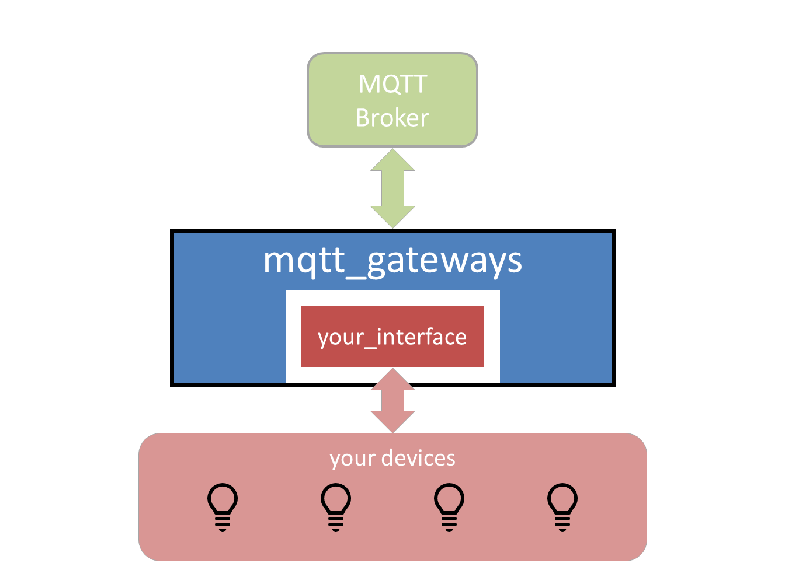

.. mqtt_gateways documentation master file, created by
   sphinx-quickstart on Thu Dec 28 09:15:08 2017.
   You can adapt this file completely to your liking, but it should at least
   contain the root `toctree` directive.

Welcome to MQTT_Gateways
=========================

**This is a work in progress**

``mqtt_gateways`` is a python wrapper to build consistent gateways to MQTT networks.

What it does:
-------------

* it deals with all the boilerplate code to manage an MQTT connection,
  to load configuration and mapping data, and to create log handlers,
* it encapsulates the interface in a class that needs only 2 methods
  ``__init__`` and ``loop``,
* it creates an intuitive messaging abstraction layer between the wrapper
  and the interface,
* it isolates the syntax and keywords of the MQTT network from the internals
  of the interface.

Who is it for:
--------------

Developers of MQTT networks in a domestic environment, or *smart homes*,
looking to adopt a definitive syntax for their MQTT messages and
to build gateways with their devices that are not MQTT enabled.

Contents
********

.. toctree::
   :maxdepth: 2
   
   Overview <overview>
   Installation <installation>
   Concepts <concepts>
   Tutorial <tutorial>
   Reference <reference>
   Indices <indices>
